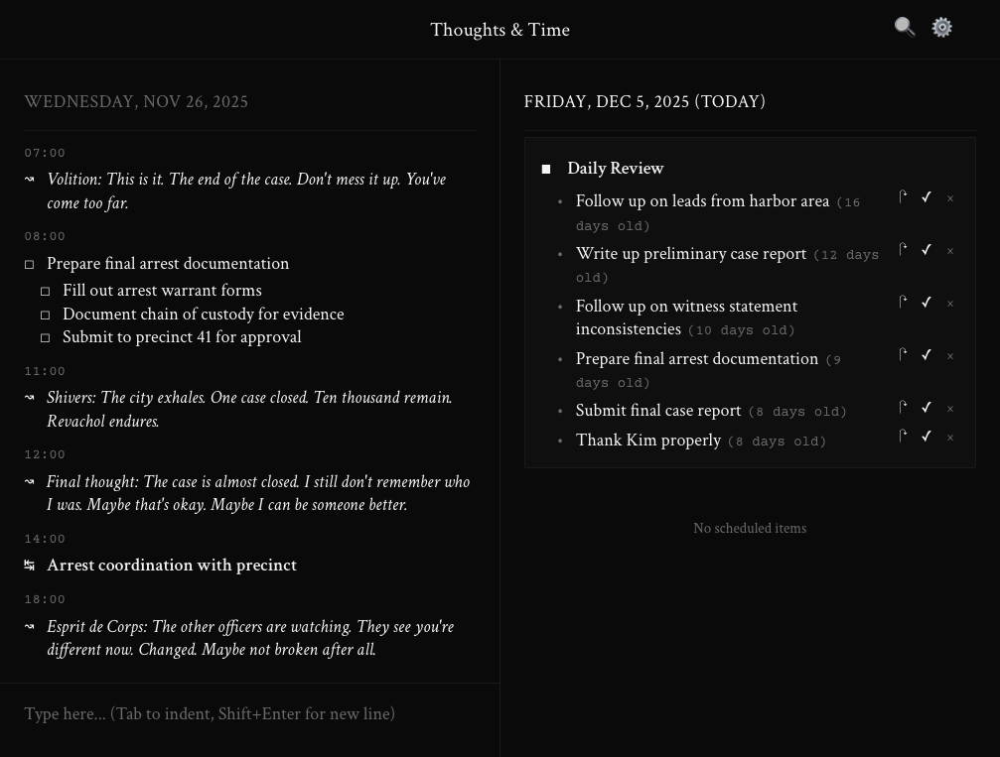
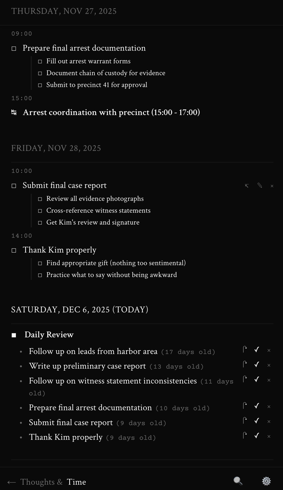
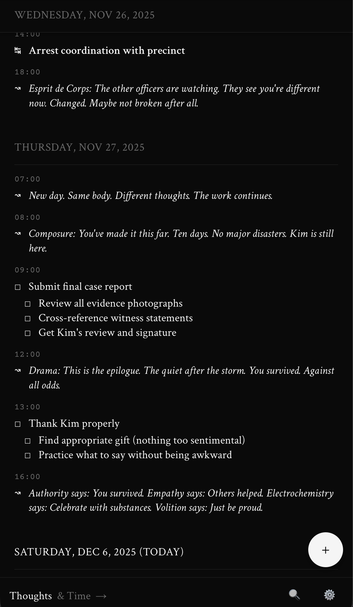

<p align="center">
  
</p>

<p align="center">
  <a href="https://www.gnu.org/licenses/agpl-3.0"></a>
</p>

<p align="center">
  <strong>Capture thoughts. Plan time. All in one place.</strong>
</p>

A simple productivity app with two panes: one for your thoughts (notes, tasks, ideas), and one for your timeline (what's scheduled, what's coming up). Everything syncs automatically and works offline.

## Screenshots

### Desktop Interface (Book Mode)



*The dual-pane interface showing the Thoughts pane (left) with notes and tasks, and the Time pane (right) with the timeline and Daily Review.*

### Mobile Interface (Infinite Scroll Mode)

<p align="center">
  
  
</p>

*Mobile views in infinite scroll mode showing the floating date header at the top. Left: Thoughts pane with all item types (notes, tasks, events) arranged chronologically. Right: Time pane with scheduled items and Daily Review section displaying incomplete tasks from previous days. Both panes feature swipe navigation and touch-optimized controls.*

## Philosophy

**Thoughts & Time** is built on the principle that productive work emerges from the intersection of free-flowing thoughts and structured time. Most productivity tools force you to choose between capturing ideas and scheduling tasks. This app bridges that gap.

### The Two Panes

- **Thoughts (Left Pane)**: Your stream of consciousness. Capture ideas, notes, tasks, and reflections as they come to you. This pane is for thinking, not just doing.

- **Time (Right Pane)**: Your timeline. See how your day unfolds, what needs to happen when, and what you've committed to doing.

The magic happens when these two views coexist. An idea can become a task. A task can spawn new thoughts. Notes provide context for scheduled work. Everything flows together naturally.

### Core Principles

1. **Minimal Friction**: Quick input with simple prefixes. No clicking through forms or navigating complex hierarchies.

2. **Natural Language**: Write "meeting at 2pm" or "call mom tomorrow" – the app understands.

3. **Contextual Structure**: Items can nest (todos can have subtasks, notes can have subnotes) but the structure emerges from your thinking, not from imposed categories.

4. **Two Modes of Engagement**:
   - **Infinite Scrolling**: For the flow state. Capture everything as it comes. Review all days at once.
   - **Book Style**: For focused reflection. One day at a time, like turning pages in a journal.

5. **Typography Matters**: Serif fonts for content (easier on the eyes, feels like writing). Monospace for metadata (clear, functional, distinct).

## How to Use

### Quick Start

1. **Adding Items**: Click the input box at the bottom of the Thoughts pane. Type your item with a prefix:
   - `t buy milk` → Creates a todo
   - `e team meeting` → Creates an event
   - `r exercise` → Creates a routine
   - `my thought` or `* my thought` → Creates a note (no prefix needed for top-level notes)

2. **Adding Time**: Include time naturally in your text:
   - `t buy milk at 5pm`
   - `e team meeting from 2pm to 3pm`
   - `t submit report on Friday`

3. **Nesting Items**: Use indentation (Tab key) to create subtasks or subnotes:
   ```
   t plan party
       t book venue
       t send invitations
       * remember to check dietary restrictions
   ```

### Item Types

**Todos (t)**: Tasks to be completed. Show up in the timeline when scheduled.
- Checkbox symbol: □ (unchecked) / ☑ (checked)
- Click the checkbox to mark complete
- Can have subtasks

**Events (e)**: Time-bound occurrences with start and end times.
- Symbol: ↹
- Always appear in the timeline
- Can span duration ("from 2pm to 4pm")

**Routines (r)**: Recurring activities.
- Symbol: ↻
- Can recur daily, weekly, monthly
- Examples: "every day", "every Monday", "first Tuesday of each month"

**Notes (no prefix or *)**: Thoughts, ideas, references.
- Symbol: ↝
- Never appear in the timeline
- Can have subnotes for elaboration
- Use `*` prefix only for subnotes

### Editing Items

Hover over any item and click the edit icon (✎). The item appears with its symbol in an editable text box:

- **Change the type**: Delete the symbol and type a new prefix letter + space
  - Type `t ` and it converts to `□ `
  - Type `e ` and it converts to `↹ `
  - Type `r ` and it converts to `↻ `
  - Type `* ` and it converts to `↝ `

- **Revert during editing**: Backspace after a symbol converts it back to the prefix letter for easy editing

- **Time prompts**: If you convert an item to a todo/event/routine without specifying a time, you'll be prompted to add one

- **Save**: Press Enter or click ✓
- **Cancel**: Press Escape or click ✕

### View Modes

**Infinite Scrolling** (Default):
- See all days at once (30 days past to 30 days future)
- Scroll seamlessly through your timeline
- Snap-to-day sections for easy navigation
- Great for capturing and planning

**Book Style**:
- One day per "page"
- Scroll to the top or bottom and keep scrolling to flip to previous/next day
- Page-turn animation (like flipping pages in a book)
- Each pane can show different days independently
- Perfect for focused daily review

Switch between modes in Settings (⚙️ icon in header).

### Search

Click the search icon (🔍) in the header to filter items across all days. The search works on:
- Item content
- Tags (use #tag in your items)
- Nested items (searching finds parent items too)

### Themes

Choose your visual preference in Settings:
- **Light**: Clean, bright interface
- **Dark**: Easy on the eyes
- **System**: Automatically matches your OS preference

### Mobile Experience

The app is fully optimized for mobile devices (phones and tablets):

**Single-Pane Navigation**:
- On screens < 768px, view one pane at a time
- Swipe left/right to switch between Thoughts and Time
- Footer navigation with active pane indicator

**Touch-Optimized**:
- Floating Action Button (FAB) for quick capture
- Bottom sheet for input (slides up from bottom)
- All buttons meet 44px minimum touch target size
- Haptic feedback on interactions (where supported)

**Smart Keyboard Handling**:
- Footer automatically hides when keyboard appears
- Optimized input layouts for touch typing
- iOS safe area support for notched devices

See [MOBILE_IMPLEMENTATION.md](./MOBILE_IMPLEMENTATION.md) for complete mobile documentation.

### Tags

Add tags anywhere in your text with `#tagname`:
- `t review #work #quarterly report`
- `interesting thought #philosophy #book-ideas`
- Tags appear below the item in smaller text
- Fully searchable

### Deleting Items

Hover over any item and click the delete icon (×). You'll be asked to confirm before deletion.

## Advanced Features

### Natural Language Time Parsing

The app understands various time expressions:

- **Absolute**: "tomorrow at 3pm", "Friday at noon", "Oct 15"
- **Relative**: "in 2 hours", "in 30 minutes", "in 3 days"
- **Ranges**: "from 2pm to 4pm", "between 10am and 12pm"

### Nested Structure

Create hierarchies by indenting (press Tab):

```
t launch website
    t design mockups
        * consider mobile-first approach
    t write copy
    t test on staging
```

Subtasks and subnotes create rich context for your work.

### Keyboard Shortcuts

- **Enter**: Submit new item (in input box) or save edit (when editing)
- **Escape**: Cancel editing
- **Tab**: Indent (create nested item)
- Type prefix + space: Convert to symbol (works in input and when editing)

## Tips for Effective Use

1. **Start each day in Book Style**: Review yesterday, plan today with focused attention.

2. **Capture in Infinite mode**: Let thoughts flow without day boundaries. See the bigger picture.

3. **Use notes liberally**: Context is valuable. Document your thinking, not just your tasks.

4. **Nest for structure**: Break complex tasks into steps. Elaborate on ideas with subnotes.

5. **Edit freely**: Change types, update times, refine wording. Your system should evolve with your thinking.

6. **Tags are for finding, not organizing**: Don't stress about tag hierarchies. Use tags to make things findable later.

7. **Let the timeline guide you**: In the Time pane, see what's coming up. Let it inform your priorities without creating pressure.

## Philosophy in Practice

This app doesn't prescribe a methodology. It won't tell you to be "productive" or "optimize" yourself. Instead, it provides a clean space where:

- Thoughts can exist without immediately becoming tasks
- Tasks can exist without losing their context
- Time provides structure without creating pressure
- The past informs the future without constraining it

Use it as a journal. Use it as a task manager. Use it as both. The tool adapts to your thinking, not the other way around.

## Running the App

### Development

```bash
cd /home/user/Thoughts-Time
npm install
npm run dev
```

Open http://localhost:5173 in your browser.

### Build for Production

```bash
npm run build
npm run preview
```

### Install as App

Thoughts & Time can be installed as a Progressive Web App (PWA) on your device:

- **Desktop (Chrome/Edge)**: Click the install icon in the address bar
- **Android**: Open menu → "Add to Home Screen"
- **iOS**: Tap Share → "Add to Home Screen"

Once installed, the app works offline and feels like a native application.

## Technical Stack

- **Frontend**: React 18 + TypeScript
- **Build Tool**: Vite
- **Styling**: Tailwind CSS
- **State Management**: Zustand with persistence
- **Date Parsing**: Chrono (natural language understanding)
- **Date Utilities**: date-fns
- **Storage**: localStorage (persistent across sessions)

## Data Storage

All your data is stored locally in your browser's localStorage. Nothing is sent to a server. Your thoughts and tasks stay on your machine.

---

## License

This project is licensed under the **GNU Affero General Public License v3.0 (AGPL-3.0)**.

**What this means:**
- ✅ You can use, modify, and distribute this software (including commercially)
- ✅ If you run a modified version as a network service, you must make the source code available
- ✅ You must give appropriate credit to "Thoughts & Time by Sawt Dakhili"
- ↪️ Any modifications must also be licensed under AGPL-3.0
- 🔓 This is OSI-approved open source software

See the [LICENSE](LICENSE) file for details or visit [AGPL-3.0](https://www.gnu.org/licenses/agpl-3.0.html).

**Copyright © 2025 Sawt Dakhili**

---

## Deployment Options

### 🆓 Free Tier (Self-Hosted)
Run your own instance using PocketBase:
- Complete control over your data
- No usage limits
- Community support
- See [SELF_HOSTING.md](SELF_HOSTING.md) (coming soon)

### 💎 Hosted Service (Coming Soon)
Let us handle the infrastructure:
- ✅ **1-week free trial** - No credit card required
- ✅ Automatic backups and sync across devices
- ✅ Always up-to-date with latest features
- ✅ Premium support
- 📊 Pricing tiers starting at **$1/month**

**Interested in early access?** Star this repo and watch for updates!

---

**Status**: Feature-complete MVP ✅

*Built with care for thoughtful work.*
